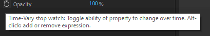
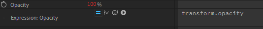

<!-- omit in toc -->
# Nos premières expressions

<!-- omit in toc -->
## Vidéo

[](#)

<!-- omit in toc -->
## Durée

:watch: 10 minutes.

<!-- omit in toc -->
## Sommaire

- [Les mots-clés réservés](#les-mots-clés-réservés)
- [L'éditeur d'expressions](#léditeur-dexpressions)
- [Le menu d'expressions](#le-menu-dexpressions)
- [Les expressions courantes](#les-expressions-courantes)
  - [Le parent](#le-parent)
  - [L'évolution temporelle](#lévolution-temporelle)
  - [Let's wiggle!](#lets-wiggle)
  - [Répétons, encore et encore](#répétons-encore-et-encore)
  - [Indice de calque](#indice-de-calque)
  - [Un peu plus d'aléatoire](#un-peu-plus-daléatoire)
  - [Les interpolations](#les-interpolations)
    - [L'interpolation linéaire](#linterpolation-linéaire)
    - [Ease, EaseIn et EaseOut](#ease-easein-et-easeout)

## Les mots-clés réservés

Dans l'API d'After Effects et dans le langage JavaScript, certains mots sont réservés. On ne peut donc pas les utiliser pour nos variables. Le mot-clé le plus utilisé est certainement `time` qui retourne la position du curseur dans la timeline, exprimée en secondes. C'est grâce à cette variable que l'on pourra faire des animations au cours du temps ! 

On considère également `value`, `index` et `parent` comme des mot-clés.

## L'éditeur d'expressions

Pour ouvrir l'éditeur d'expressions, il suffit de cliquer sur le chronomètre de l'une des propriétés d'un calque tout en maintenant enfoncée la touche `alt`.




Comme on peut le voir, la propriété devient rouge. Cela signifie qu'elle est pilotée par une expression. Ici, l'expression de référence qui se cache derrière la propriété `opacité` est : `transform.opacity`. Le `transform` fait référence au groupe de propriétés duquel la propriété d'opacité fait partie. Ici, la propriété d'opacité du calque fait donc référence à elle-même.

On retrouve également 4 petits boutons :
- les deux petites barres permettent d'activer ou de désactiver l'expression.
- le graphique permet de montrer l'effet de l'expression sur la propriété au cours du temps.
- le petit escargot (le pick whip) permet de faire référence facilement à d'autres propriétés ou d'autres calques.
- la flèche permet d'ouvrir un menu bien pratique dont on parlera juste après.

Essayez d'utiliser le *pick whip* afin de voir ce qu'il se passe ! Vous verrez que c'est un outil extrêmement pratique pour se référencer à d'autres propriétés. Vous verrez peut-être quelque chose comme cela apparaître :

`thisComp.layer("Solid").transform.position[0]`

Si on lit de droite à gauche, on comprend que l'on fait référence à :
- la première valeur du tableau `position` (donc la valeur représentant le **x**)
- du groupe de transformation
- du calque qui s'appelle "Solid"
- et qui se trouve dans cette même composition

Nous avons maintenant toutes les cartes pour se lancer !

## Le menu d'expressions

On vient de voir qu'il existait un menu bien pratique pour les expressions. En effet, celui-ci permet de présenter quasiment tous (si ce n'est tous, d'ailleurs) les mots-clés dont on va pouvoir user. Il y a, à la fois, des attributs et des méthodes ! Parcourez les et essayez d'en comprendre quelques uns ! :wink:

## Les expressions courantes

### Le parent

Parfois, il peut être utile de modifier une propriété d'un calque en fonction de son calque parent. Eh bien, c'est le mot-clé `parent` que l'on utilisera pour y faire référence. On pourra ainsi gérer son opacité en fonction de celle du parent, par exemple !

### L'évolution temporelle

Pour créer une animation simple, on peut utiliser la variable `time`. La variable `time` (float) s'incrémente sur chacune des frames. Cela nous permet de l'utiliser pour faire évoluer une propriété à travers le temps. Le plus courant est de l'utiliser en tant que variable d'une fonction du premier degré (fonction affine) :

```js
origin + time * coef
```

:pencil: Notons que lorsqu'il n'y a qu'une seule instruction (ou que c'est la toute dernière), le point-virgule pour terminer l'instruction n'est pas nécessaire.

### Let's wiggle!

Les évolutions suivant des fonctions "classiques", c'est bien ! Mais parfois, on a besoin d'un peu plus d'aléatoire ! Et pour cela, on utilise la méthode `wiggle`. En anglais, "wiggle" signifie "remuer" ou "gigoter".

Comme on peut le voir dans [la documentation](https://ae-expressions.docsforadobe.dev/property.html?highlight=wiggle#wiggle-freq-amp-octaves-1-amp-mult-0-5-t-time), `wiggle` prend jusqu'à 5 arguments. Les deux premiers sont obligatoires, les trois suivants sont optionnels vu qu'ils possèdent une valeur par défaut.

```js
const freq = 2; // Fréquence du wiggle (nombre de fois qu'il se produit par seconde).
const amp = 10; // Amplitude du wiggle.

wiggle(freq, amp)
```

### Répétons, encore et encore

De temps en temps, on a besoin de répéter une animation. Or, dupliquer les keyframes n'est pas très pratique. De plus, ce n'est pas modulable : si l'on veut modifier l'animation, on devra le faire sur toutes les répétitions.

Pour pallier ce problème, nous avons à notre disposition plusieurs méthodes : `loopIn` et `loopOut`. Ces méthodes fonctionnent de la même façon, à l'exception que l'une fait des répétitions **jusqu'aux** keyframes de la propriété tandis que l'autre fait des répétitions **à partir** des keyframes de la propriété.

Regardons de [plus près](https://ae-expressions.docsforadobe.dev/property.html?highlight=loopout#loopout-type-cycle-numkeyframes-0) `loopOut` :

```js
loopOut(type="cycle", numKeyFrames=0)
```

Il existe 4 types différents qui sont utilisables :
- `cycle` qui répète exactement l'animation définie par les keyframes.
- `pingpong` qui joue l'animation à l'endroit, puis à l'envers, puis à l'endroit, etc.
- `offset` qui répète exactement l'animation définie par les keyframes mais en introduisant à chaque nouveau cycle un décalage dû au cycle courant.
- `continue` qui ne répète pas l'animation mais qui va la continuer en se basant sur la vélocité de la dernière keyframe.

Le second paramètre `numKeyFrames` permet de spécifier quel segment de l'animation on souhaite réellement répéter. La valeur 0 par défaut indique que l'on prend en compte toutes les keyframes. Le plus simple, c'est d'expérimenter pour bien comprendre car ce n'est pas facile à expliquer à l'écrit.

:bulb: Je me souviens avoir vu une utilisation très intéressante du `loopOut` pour répéter une vidéo en boucle, tout le long de la composition ! L'idée était de simplement appliquer cette méthode sur la propriété de remappage temporel en mettant une keyframe au tout début du calque et une autre sur l'avant-dernière frame ! Je crois avoir découvert cela dans les tutoriels de Nabscript mais ils ne semblent plus accessibles aujourd'hui, donc je n'en suis pas sûr.

### Indice de calque

On a vu que l'on pouvait facilement faire des animations dans le temps ! Mais on peut également se servir de la liste des calques de la composition pour moduler nos propriétés. En effet, chaque calque dispose d'un `index` que l'on peut utiliser.

Supposons ceci, sur la propriété de position :

```js
const x = index * 100 + 200; 
const y = transform.position[1]; // Fait référence à sa propre valeur actuelle de position sur l'axe Y.

[x,y]
```

Il nous suffit de dupliquer le calque pour créer un objet décalé sur l'axe **X** de 100 unités ! C'est un exemple très simple, mais très révélateur du pouvoir que détient cette variable `index`. On le verra notamment lorsque l'on souhaitera créer des templates.

### Un peu plus d'aléatoire

Il existe plusieurs méthodes pour générer des nombres aléatoires. En réalité, ce sont des nombres pseudo-aléatoires, mais c'est un détail.

La méthode `random()` permet de générer un nombre aléatoire entre 0 et 1. Par défaut, un nouveau nombre est généré à chaque frame. Pour contrôler cela, il faut utiliser, au préalable, la méthode `seedRandom(offset, timeless = false)` en passant au paramètre `timeless` la valeur `true`. Le paramètre `offset` permet de modifier la graine de génération des nombres aléatoires afin d'en obtenir une nouvelle série.

Pour obtenir des nombres dans un certain intervalle, la méthode `random` dispose aussi de plusieurs surcharges : `random(maxValOrArray)`, `random(minValOrArray, maxValOrArray)`.

Si vous souhaitez une distribution de Gauss, il existe également les mêmes méthodes pour cela.

Un exemple simple (toujours sur la propriété de position) :

```js
seedRandom(0, timeless = true); // Empêche de regénérer un nouveau nombre à chaque frame.
const x = random(0, 800);
const y = random(0, 800);

[x, y]
```

### Les interpolations

On termine ce chapitre avec les interpolations ! Ce sont les méthodes les plus pratiques du monde pour faire des animations, notamment ! L'idée étant simplement de passer d'un intervalle à un autre, en suivant une certaine courbe.
Si ça paraît flou dit comme ça, on va vite voir ce que ça donne en vrai !

#### L'interpolation linéaire

L'interpolation linéaire permet de passer d'un intervalle à l'autre de façon... linéaire ! Eh oui, ahah ! :stuck_out_tongue_winking_eye:

Les méthodes d'interpolation prennent 3 ou 5 arguments. Etant donné que l'on souhaite passer d'un intervalle à un autre, nous allons utiliser celles qui prennent 5 arguments.

- la valeur qui nous sert de référence.
- la valeur minimale de l'intervalle de départ.
- la valeur maximale de l'intervalle de départ.
- la valeur minimale de l'intervalle d'arrivée.
- la valeur maximale de l'intervalle d'arrivée.

```js
// Ici, la variable de référence est le temps. 
// Cela veut dire qu'entre 0 et 3 secondes, la fonction renverra la valeur correspondante dans l'intervalle [0, 100]. 
// Par exemple, à 2 secondes, la valeur sera 67.
linear(time, 0, 3, 0, 100);


// Ici, la variable de référence est une variable déclarée par nous-même. 
// Elle peut, ou non, évoluer au cours du temps. 
// Supposons que x = 50, alors la fonction renverra 960.
linear(x, 0, 100, 0, 1920);
```

#### Ease, EaseIn et EaseOut

L'interpolation linéeaire, c'est bien mais parfois, on a besoin de quelque chose de plus lisse, surtout si c'est pour des animations ! Pour cela, il existe les méthodes `ease`, `easeIn` et `easeOut` qui fonctionnent sur le même principe !

-----

:arrow_backward: Page précédente non disponible pour le moment

:arrow_forward: Page suivante non disponible pour le moment