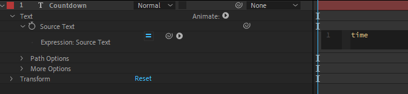
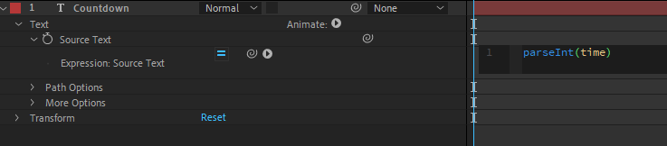
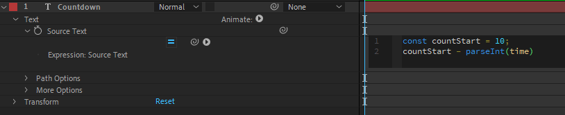
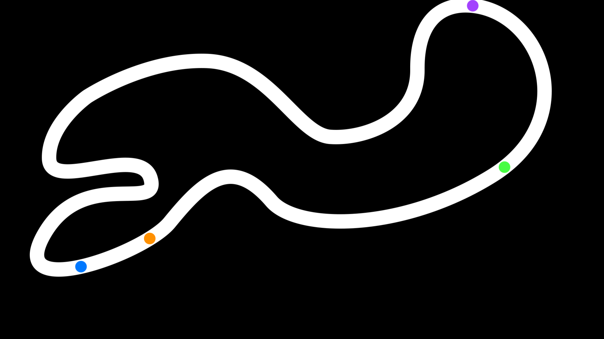
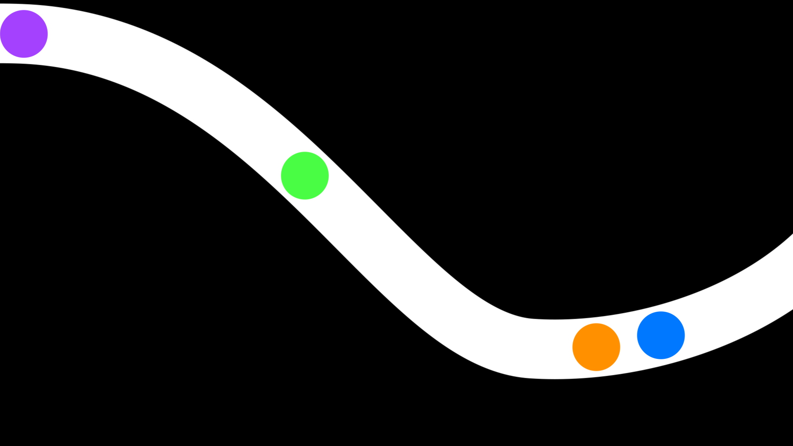

<!-- omit in toc -->
# Exemples concrets utilisant des Expressions

<!-- omit in toc -->
## Vidéo

[](https://www.youtube.com/watch?v=WBx8rwAlCgg)

<!-- omit in toc -->
## Durée

:watch: 12 minutes.

<!-- omit in toc -->
## Sommaire

- [The Final Countdown](#the-final-countdown)
- [La balle pas rebondissante](#la-balle-pas-rebondissante)
- [Un chemin intelligent](#un-chemin-intelligent)
- [La Mario "Carte"](#la-mario-carte)
  - [Détails de mon approche](#détails-de-mon-approche)
- [Pour aller plus loin](#pour-aller-plus-loin)
- [Ressources](#ressources)

## The Final Countdown

Pour ce premier exemple, quelque chose de très simple ! Nous allons reproduire un compte-à-rebours en quelques clics. L'idée est triviale : utiliser la variable `time` pour modifier le texte source d'un calque de texte.



Si l'on s'arrête là, on a deux problèmes :

- le temps augmente au lieu de décroître.
- c'est un nombre à virgule (et nous, on ne veut pas de décimales).

Commençons par résoudre le second problème. Afin d'obtenir un nombre "rond", on pourrait utiliser les méthodes `floor()` et `ceil()` de la librairie mathématique afin d'arrondir à l'entier inférieur ou supérieur (respectivement). On pourrait également convertir le nombre à virgule (flottante) en nombre entier (int). Pour ce faire, on utilise la méthode `parseInt()`.

Ici, on a donc le choix entre `Math.floor()` et `parseInt()`. Attention, dans ce cas, le résultat est le même mais dans les faits, un nombre flottant "rond" et un entier (int) ne sont pas la même chose.



Maintenant, pour créer un compte-**à-rebours**, il nous suffit de rajouter une constante et de lui soustraire le temps qui passe.



Nous voilà avec un vrai compte-à-rebours !

:pencil: On pourrait même le personnaliser davantage en prenant le nombre de départ comme étant égal à la durée de la composition (`thisComp.duration`) ! :wink:

## La balle pas rebondissante

Maintenant, nous allons créer une balle qui va décrire une trajectoire parabollique et qui va "rouler" sur le sol. Le modèle utilisé est **très simplifié**. C'est pourquoi nous n'aurons aucun rebond, aucune considération de frottements de l'air, etc.

C'est ce que l'on appelle de la dynamique de point. On va considérer que notre balle concentre toute sa masse en un seul point : son centre de gravité (pour nous, son point d'ancrage).

Nous avons besoin de trois vecteurs :

- un vecteur décrivant la position initiale : pInit = [pX, pY]
- un vecteur décrivant la vitesse (vélocité) initiale : vInit = [vX, vY]
- le vecteur de gravité : g = [0, 9.8] (attention, je mets `9.8` et non pas `-9.8` car les coodonnées dans After Effects sont inversées : plus on descend, plus la valeur sur l'axe des Y grandit)

A partir de la seconde loi de Newton, on peut facilement en déduire que l'accélération de la balle équivaut à la gravité et en remontant les calculs, on trouve les deux formules suivantes :

- `x(t) = vInit[0] * t + pInit[0]` (la vélocité initiale en X multipliée par le temps + la position initiale en X)
- `y(t) = 0.5 * g[1] * t² + vInit[1] * t + pInit[1]` (la moitié de la gravité en Y multipliée par le temps au carré + la vélocité initiale en Y multipliée par le temps + la position initiale en Y)

A partir de là, on peut donc projeter notre balle dans les airs ! Le modèle est très simplifié donc on n'aura aucune déformation ou même aucune rotation de l'objet. Seule la position en sera affectée. Maintenant, il ne reste plus qu'à "créer" un sol afin que la balle ne tombe pas indéfiniment. Une simple condition `if` suffit.

```js
// Used to set the values to a "pixel" equivalent.
const coefToPixels = 100;
// Define the height of the imaginary floor using the size of the Ellipse shape layer.
const floorY = 1080 - content("Ellipse 1").content("Ellipse Path 1").size[1]/2;

// Define the three vectors we need.
const pInit = [72, 400];
const vInit = [4, -8] * coefToPixels;
const g = [0, 9.8] * coefToPixels;

// Compute the formulas. Clamp the Y value to avoid passing through the floor.
const x = vInit[0] * time + pInit[0];
let y = 0.5 * g[1] * time * time + vInit[1] * time + pInit[1];
if (y > floorY) y = floorY;

// Assign the values to the property.
[x, y]
```

## Un chemin intelligent

Parfois, on aimerait qu'un objet suive un certain chemin tracé par un masque, par exemple. La solution simple est de faire un `Ctrl+C` sur la propriété du chemin et d'aller faire un `Ctrl+V` sur la propriété de position de l'objet. On se retrouve alors avec des keyframes "dynamiques" (option `Rove across time`). C'est quand même plutôt bien fait, on ne va pas se mentir ! Le souci, c'est que l'on a vraiment une copie pure et dure du chemin (et non pas une référence vers ce chemin). Cela signifie que si le chemin est modifié, notre objet ne se déplacera plus le long de celui-ci. Triste. :cry:

Pour contrer cela, on va utiliser les expressions bien sûr ! C'est même très simple : les chemins ont une méthode qui s'appelle `pointOnPath(percentage)`. Cette méthode renvoie un vecteur de position en fonction du "pourcentage" passé en argument (valeur entre 0 et 1 : 0 représentant le début du chemin et 1 la fin).

Mais pour avoir cette valeur entre 0 et 1, on fait comment ? :thinking:

...

...

On utilise les interpolations, bien évidemment !

```js
const percent = linear(time, timeBegin, timeEnd, 0, 1);
thisComp.layer("PATH").mask("Mask 1").maskPath.pointOnPath(percent);
```

Maintenant, les variables `timeBegin` et `timeEnd`, on peut les définir soit à la main (en "dur") ou soit d'une façon plus sympa dont j'ai déjà parlé dans le chapitre précédent : avec des marqueurs. Il suffit de mettre deux marqueurs sur **le calque** (et non pas la composition) et de récupérer la valeur de temps leur correspondant :

```js
// Attention, les marqueurs commencent à l'indice 1 et non pas 0.
const timeBegin = marker.key(1).time;
const timeEnd = marker.key(2).time;
```

Et nous voilà avec une animation qui suit parfaitement le chemin et à la vitesse que l'on veut !

## La Mario "Carte"

Cet exemple vient clotûrer ce chapitre. Je le trouve intéressant car c'était une véritable demande que m'avait faite un ami il y a quelques années. En le refaisant pour cette formation, je me suis aperçu que je l'avais considérablement amélioré. On en reparle dans la partie suivante ! :wink:

L'idée ici, c'est d'appliquer ce que l'on a vu jusque là afin de faire une carte de circuit Mario Kart qui soit dynamique : la caméra doit toujours être centrée sur les voitures et on doit toujours voir **toutes** les voitures. Le but est tout de même de faire en sorte que la carte soit "zoomée" le plus possible afin de voir l'avancement de la course avec un maximum de détails !





```
Comme on peut le remarquer, toutes les voitures sont toujours visibles : la vue du circuit s'adapte en fonction de leurs positions.
```

Contraintes :

- Le circuit doit pouvoir être modifiable à tout moment : cela signifie qu'il faudra utiliser la technique vue précédemment pour calculer la position des voitures au cours du temps.
- Afin de pouvoir contrôler facilement la vitesse des voitures, il faudra utiliser des marqueurs sur les calques.
- La caméra doit **toujours** voir toutes les voitures sur le circuit mais elle doit concentrer son champ de vision au maximum afin que l'on puisse aisément suivre l'avancement des voitures (cf figure 2).

:pencil: Plusieurs approches sont possibles. Celle que j'ai utilisée, que je trouve la plus "logique" et maintenable, est d'avoir une caméra **One-Node** et de déplacer cette caméra sur l'axe Z (mouvement de dolly) afin de se rapprocher ou s'éloigner du circuit. Centrer la caméra sur toutes les voitures (axe X et Y) n'est pas trop difficile. Pour bien placer la caméra sur l'axe Z, ça demande davantage de réflexion (le dessin qui apparaît quand on entre dans les propriétés du calque Caméra (`Ctrl+Shift+Y`) est très utile).

Bon courage !! :muscle:

### Détails de mon approche

Dans cette vidéo, on détaille l'approche que j'ai utilisée afin d'accomplir cet exemple !

:warning: Spoiler !!

Lien vers la vidéo à venir...

## Pour aller plus loin

Si vous souhaitez aller plus loin avec les expressions, il existe déjà de nombreuses vidéos en ligne sur le sujet. Je vous conseille notamment [cette série de vidéos](https://www.youtube.com/playlist?list=PLZAr8tT8TcsRj62nIO7ILCMitj5RKjsMf) très courtes (mais très très rapides) pour développer vos idées et comprendre à quel point les expressions, c'est cool ! :sunglasses:

## Ressources

- [Mécanique : dynamique newtonienne](https://www.kartable.fr/ressources/physique-chimie/fiche-bac/mecanique/22869)
- [Place objects along a path](https://www.youtube.com/watch?list=PLZAr8tT8TcsRj62nIO7ILCMitj5RKjsMf&v=wmbIebDsWn0&feature=emb_title)
- [After Effects Incredible Expressions Challenge](https://www.youtube.com/playlist?list=PLZAr8tT8TcsRj62nIO7ILCMitj5RKjsMf)

-----

:arrow_backward: [Nos Premières Expressions](https://github.com/Julien-Haudegond/Formation-Code-After-Effects/tree/main/1.Expressions/03.Nos_Premieres_Expressions)

:arrow_forward: Page suivante non disponible pour le moment