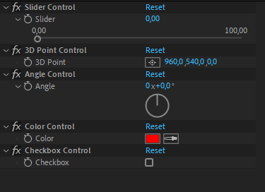
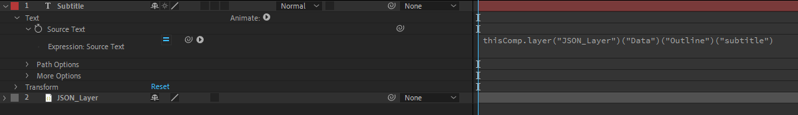
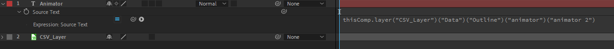

<!-- omit in toc -->
# Contrôles et Templates

<!-- omit in toc -->
## Vidéo

[](https://www.youtube.com/watch?v=HspAgii_ED8)

<!-- omit in toc -->
## Durée

:watch: 9 minutes.

<!-- omit in toc -->
## Sommaire

- [Les contrôles d'expression](#les-contrôles-dexpression)
  - [Avantages et inconvénients](#avantages-et-inconvénients)
- [Les templates](#les-templates)
  - [Données externes](#données-externes)
    - [JSON](#json)
    - [CSV](#csv)
    - [Accéder différemment aux fichiers externes](#accéder-différemment-aux-fichiers-externes)
    - [Note sur les fichiers externes](#note-sur-les-fichiers-externes)
  - [What's your name?](#whats-your-name)
  - [Le pseudo modèle Vue/Composants](#le-pseudo-modèle-vuecomposants)
- [Ressources](#ressources)

## Les contrôles d'expression

Pour paramétrer facilement les expressions, After Effects met à notre disposition les **contrôles d'expression**. Ces derniers permettent de contrôler les valeurs de certaines variables grâce à une interface.

En voici quelques uns :



Ces contrôles d'expression sont en réalité des effets que l'on applique à un calque. Leur unique rôle est d'être référencé dans des expressions.

On peut appliquer des contrôles d'expression sur le calque pour lequel on utilise l'expression en question. Mais on peut également les mettre sur d'autres calques. Cette deuxième option est très utilisée : on crée souvent un calque nul **CONTROLLER** sur lequel on vient "construire" cette interface de contrôle qui sera référencée par toutes les expressions de la composition. De cette manière, tout est personnalisable au même endroit, et ce, très rapidement.

### Avantages et inconvénients

Comme on peut s'en douter, c'est extrêmement pratique pour contrôler des paramètres "uniques" et ça l'est encore plus pour des paramètres "communs" (e.g. la palette de couleurs des éléments graphiques).

L'unique inconvénient, à mon sens, est que ça peut paraître assez long à mettre en place. C'est un inconvénient mineur, dans le sens où ça peut accélérer considérablement le workflow par la suite. Cependant, il est vrai que penser à connecter les couleurs de chaque élément au **contrôle d'expression** peut rapidement devenir pénible.

Si l'on souhaite avoir un projet personnalisable et facilement éditable, c'est une approche parfaite. Mais si, au contraire, tout est déjà figé dans le marbre et que c'est sûr que ça ne changera pas, il n'y a pas besoin de s'embêter avec ça. 

Après tout, c'est comme pour toutes les expressions ! Souvent, c'est plus long à mettre en place, mais c'est aussi plus agréable à personnaliser par la suite.

## Les templates

Un template, c'est un projet qui se veut personnalisable : c'est le principe de base. C'est pourquoi de nombreux templates reposent sur une utilisation excessive des expressions : changer des couleurs, changer des textes, changer la durée des animations, la taille du logo, adapter dynamiquement la taille des bandeaux à la longueur du texte, etc.

### Données externes

After Effects nous offre la possibilité de récupérer des informations dans des fichiers textuels externes JSON ou CSV.

Ces fichiers peuvent être utilisés pour spécifier aisément des valeurs à fournir à After Effects. Il est même possible de mettre à jour ces données avec une autre application afin de créer des templates qui s'adaptent en temps réel (utile pour un visuel de météo, par exemple).

#### JSON

JSON (JavaScript Object Notation) décrit des objets à la manière d'un objet en JavaScript.

```json
{
  "title" : "Titre du projet",
  "subtitle" : "Sous-titre du projet",
  "animator" : "John Doe"
}
```

Le JSON fonctionne sur le principe clé/valeur. Les clés sont uniques, et à chaque clé correspond une valeur. On peut ainsi récupérer les informations très simplement sur After Effects.



Ici, le texte affiché par le calque texte est donc `Sous-titre du projet` puisque c'est la valeur correspondant à la clé `subtitle`.

#### CSV

CSV (Comma-separated values) décrit des informations sous la forme d'un tableau, en séparant les valeurs par une syntaxe précise (la virgule, de base).

```csv
title,subtitle,animator
Emission du lundi,Sous-titre de l'émission du lundi, John Doe du lundi
Emission du mardi,Sous-titre de l'émission du mardi, John Doe du mardi
Emission du mercredi,Sous-titre de l'émission du mercredi, John Doe du mercredi
```

La première ligne décrit les clés. Les lignes suivantes sont les données. Ici, on a donc 3 lignes de données (la première ligne de données a pour indice : 0).



Ici, le texte affiché par le calque texte est donc `John Doe du mercredi` puisque c'est la valeur correspondant à la ligne 2 et à la colonne `animator`.

Bien sûr, c'est un mauvais exemple mais l'idée est là ! Si les données sont sous forme de tableau, le CSV peut être très pratique.

:pencil: Le calque CSV nous donne accès au nombre de lignes de données via `Number of Rows`. On peut donc aisément faire une boucle afin de récupérer toutes les données (moyennant un petit hack de concaténation de strings).

#### Accéder différemment aux fichiers externes

Avec la façon que l'on a vue ici, on est obligé d'importer le calque JSON ou CSV dans la composition puis ensuite d'appeler chaque clé avec une syntaxe un peu désagréable. En fait, on peut éviter cela mais ça a un prix : on perd l'accessibilité par clé. Il faut donc récupérer les données par indices. C'est une méthode qui peut être pratique pour des fichiers très légers mais qui s'avère rapidement ingérable.

```js
footage("JSON.json").dataValue([0]) // Retourne la valeur de la première clé (title).

footage("CSV.csv").dataValue([0,0]) // Retourne la valeur de la première colonne (title) et de la première ligne (lundi).

footage("CSV.csv").dataValue([2,1]) // Retourne la valeur de la troisième colonne (animator) et de la deuxième ligne (mardi).
```

#### Note sur les fichiers externes

Dans les exemples ci-dessus, on a uniquement vu des chaînes de caractères pour modifier des textes mais on peut y mettre tout type de donnée : des nombres, des angles, des couleurs. Finalement, toute la personnalisation d'une composition peut se faire via un fichier JSON, par exemple.

### What's your name?

Il y a un truc que je trouve très pratique, c'est notamment l'attribut `name` des calques. Si l'on part du principe que nos calques portent un nom explicite et normalisé (e.g. **Title**), on peut s'en servir pour de nombreuses choses :

- l'utiliser pour retrouver la valeur de la clé "title" d'un fichier JSON.
- l'utiliser dans des conditions (if) ou des switch cases.
- l'utiliser en tant que source de texte directement.
- faire référence à d'autres calques portant le même nom dans d'autres compositions.
- etc.

Un petit hack possible, c'est notamment de modifier l'intérieur d'une composition depuis l'extérieur de cette composition (avec des contrôles d'expression, par exemple) : principe du modèle Vue/Composants présenté juste après.

:warning: En terme de maintenabilité et d'utilisation, cette méthode n'est vraiment pas incroyable. Seulement, c'est le seul moyen que j'ai trouvé jusque là pour contrôler l'intérieur des compositions depuis une interface "externe". Dommage que l'on ne puisse pas faire comme dans Houdini par exemple, où il est possible d'interfacer certains paramètres pour y accéder de l'extérieur. :pensive:

### Le pseudo modèle Vue/Composants

Quand on souhaite faire un projet assez conséquent, utiliser un modèle de construction Vue/Composants peut donc être une bonne idée (à méditer).

:grey_question: Mais qu'est-ce donc que cela ?

En résumé, la **Vue** (View) c'est ce que l'on voit au global, en tant qu'utilisateur. Les **Composants** (Components) sont des éléments individuels qui viennent s'intégrer dans la Vue. La Vue, c'est un peu comme un puzzle au global où les Composants seraient les pièces le constituant.

Je me suis notamment servi de ce modèle pour créer une petite interface HUD (Head Up Display). J'ai déjà effectué un tutoriel sur ce principe donc voici la vidéo, ce sera plus simple !

[After Effects : Tutoriel Interface Automatisée avec .JSON (View/Components)](https://www.youtube.com/watch?v=CKu6czawJuw)

:warning: A l'époque, j'utilisais encore une ancienne version d'After Effects qui n'avait pas le nouveau moteur JavaScript. C'est pourquoi j'utilisais notamment des *var*. A vous de le ré-adapter au nouveau moteur !

## Ressources

- [Ukramedia sur YouTube (excellente chaîne pour apprendre la programmation avec After Effects)](https://www.youtube.com/user/ukramedia)

-----

:arrow_backward: [Exemples concrets](https://github.com/Julien-Haudegond/Formation-Code-After-Effects/tree/main/1.Expressions/04.Exemples_Concrets)

:arrow_forward: [Conclusion](https://github.com/Julien-Haudegond/Formation-Code-After-Effects/tree/main/1.Expressions/06.Conclusion)